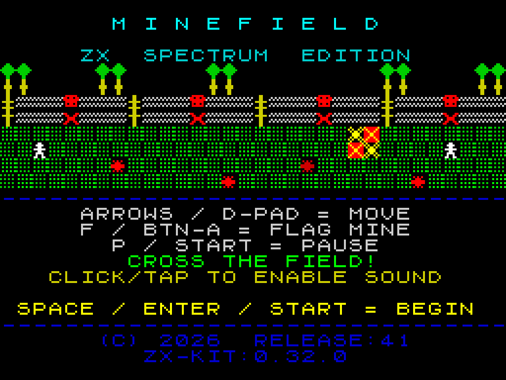
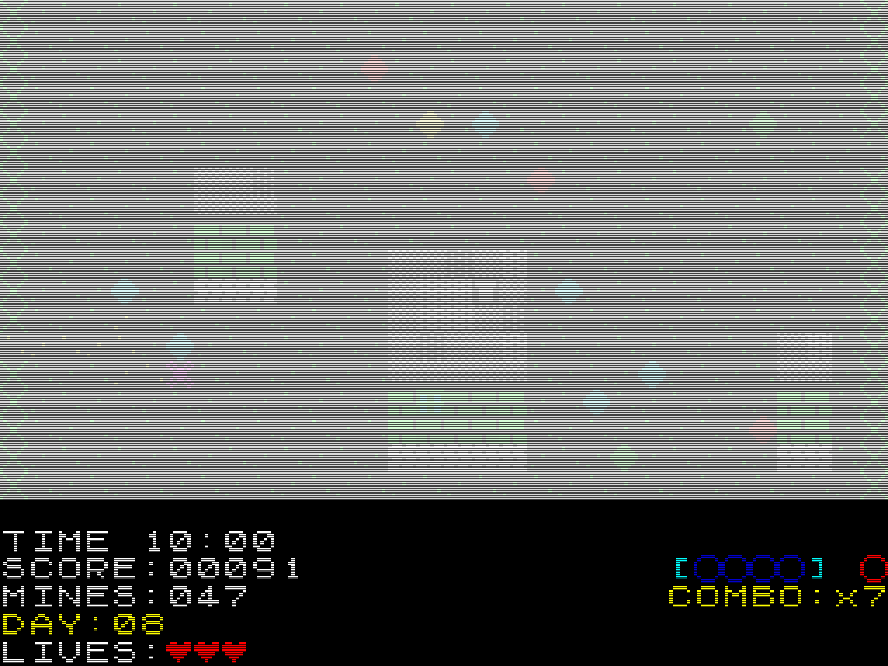

# MINEFIELD — ZX Spectrum Edition

> *The game's name is **Minefield** — on the title screen, in the browser tab, in the repository, in
> the URL. A rename to "The Strip" was planned and cancelled on 2026-08-16; that name now belongs
> only to the **place** in the story. See [ROADMAP](ROADMAP.md) → Decisions.*

> A retro browser game inspired by 1980s ZX Spectrum titles. Cross a blind minefield by **listening** —
> the closer the mines, the more urgent the sound — backed by a visual danger detector for players
> who can't (or don't want to) rely on audio.
> Vanilla TypeScript · HTML5 Canvas · Web Audio API · [zx-kit](https://www.npmjs.com/package/zx-kit)

**Live:** GitHub Pages · auto-released via semantic-release on push to `main`.

## Screenshots

  
  

  <a href="https://zrebec.github.io/minefield/">Play</a> ·
  <a href="ROADMAP.md">Roadmap</a> ·
  <a href="CHANGELOG.md">Changelog</a> ·
  <a href="docs/known-issues.md">Known issues</a>

## At a Glance

| Property | Value |
|---|---|
| Status | Playable · **LIVE** · stabilising toward 1.0 |
| Runtime | Browser game (static Vite bundle) |
| Stack | TypeScript · Vite · Canvas · Web Audio · zx-kit |
| Native resolution | 256×192 (integer ×4) |
| Runtime dependencies | `zx-kit` only |

*(Current status, test counts and the road to 1.0 live in [ROADMAP.md](ROADMAP.md) — the single
source of truth for project state.)*

---

## Story

*Two countries that never declared a war — and never ended one.* Between them they carved a stretch of
no man's land and called it **the Strip**. Overnight it tore families apart — mothers from sons, lovers,
friends, each stranded on a different side — and **each night a plane reseeds the Strip** with mines to keep
them apart. (That is the in-world reason the **daily** field changes every day, and why an aircraft keeps
sowing mines mid-run.) For years no one could cross; the field swallowed all who tried.

Then **one man** watched *how* they sowed it, found the **pattern**, and built a **home-made sonar** that
hears a mine close by — and suddenly knew a safe way through. The people would not risk their own lives, so
they pressed **parcels** into his hands — for a mother, a love, a son across — and he carries them home.
*Sowing = the daily reseed · the pattern = the seed · the sonar = the audio warning · the parcels = the
gems · crossing = the win.*

A **5-chapter typewriter intro** (THE DIVIDE · TORN APART · NO WAY ACROSS · THE RUNNER · NEW HOPE) tells it
the first time you play (replay anytime with `I`; any key advances / skips). Each chapter is **hand-drawn in
8×8 tiles** (clash-correct by construction; dithered night skies via the kit's `drawShade`) and carries its
own **AY underscore** — a melancholic loop per card that darkens to a funeral dirge for *No Way Across* and
resolves into Beethoven's *Ode to Joy* for *New Hope*. AY is the **only** place Minefield touches the chip;
gameplay stays pure beeper.

---

## About

You're dropped into a **fenced** minefield and have to cross it — in through a gap in the left fence,
out through the **exit gap** in the right. You can't *see* the mines, you *hear* them: the more mines
around you, the lower and more intense the warning after each step. A **visual detector** in the HUD
mirrors that warning, so the game is fully playable without sound. Leave a coloured trail, collect
gems, and watch the sky — every few dozen seconds an aircraft flies over and drops fresh mines.

The field isn't open: **pseudo-3D buildings** (high-angle roofs with brick fronts) are scattered
across it as solid, mine-free obstacles you must go around. There are more of them each level, so
the field gradually becomes an irregular maze. They stay visible at night when the terrain darkens.

**The field is fenced in.** A solid perimeter wall runs down the left and right edges, each with a
single gap: the **entry** (your seeded start row) and the **exit** (a different seeded row, kept at
least a few rows apart, so there's never a straight line across). The exit is the only way out — you
have to *find a route* to it, not just walk right. Crucially, **the field is traversable under all
circumstances**: at generation a flood-fill proves a full safe entry→exit route (regenerating
deterministically on a board that lacks one, and — if every reroll stays sealed — **deterministically
defusing the mines on one shortest route**, so solvability is guaranteed by construction, not by
luck), and **the aircraft can never seal it either** — every airdrop is checked and any mine that
would cut the last safe route is discarded. A field is therefore **always winnable** — the challenge
is finding the path, not getting handed (or dropped) an impossible board.

Two ways to play:

- **Daily** — the seed is the date, so everyone in the world plays the **same field** that day
  (Wordle-style comparable scores). Scores count toward the leaderboard.
- **Random** — a fresh field for practice; **never** written to the leaderboard.

It's a deliberate homage to the ZX Spectrum (1982): pixel art with no anti-aliasing, the exact
15-colour palette, the 8×8 ROM bitmap font, and biting 1-bit-flavoured square-wave sound.

---

## Controls

| Key | Action |
|-----|--------|
| `←` `→` `↑` `↓` | Move (key-repeat: 150 ms delay, 80 ms interval). Also full **gamepad** support. |
| `F` | Flag / unflag the cell **in front** of the player |
| `SHIFT + ←→↑↓` | Flag / unflag the adjacent cell in that **absolute** direction (no turning needed) |
| `P` | Pause / resume |
| `SHIFT + S` | Manual save |
| `E` | **Speak the exit's bearing** relative to you (e.g. "22 right, 3 up") **+ play the exit beacon** — a single tone that grows **louder as you close on the exit column** and **rises in pitch when the exit is north of you** (lower when south); when you're **level with the exit it becomes a double beep** (head straight east from there). No panning (the exit is always east). Accessibility, in-game only |
| `G` | **Speak the nearest gem's bearing** + how many remain — accessibility, in-game only |
| `H` | **Replay the audio legend** (what the sounds mean) — any screen except high-score name entry |
| `D` | **Sonar sweep + reveal** (while standing, any time). Every press plays an audio radar sweep of mines within `SCAN_RADIUS`: one ping per mine, nearest first — **pan = east/west, pitch = north/south (higher = north), volume = distance**; a single low tone = nothing in range. The sweep is **unlimited for everyone** (its cost is the ~2 s it takes on the live clock). The **visual** reveal keeps its budget: capped on **random/practice** (1 activation per level, `RANDOM_REVEAL_LIMIT`); **disabled on the daily** (`DAILY_REVEAL_LIMIT = 0` — it would leak the scored solution); your next step hides it again (a budgeted *peek*). |
| `O` | Toggle the **FPS / CPU debug overlay** (zx-kit `debug` module) |
| `+` / `-` | Volume up / down |

The `E` / `G` bearings are **parity, not an assist** — a sighted player sees the exit hole and gems on the
scout screen, so a blind player hearing them evens the field (mines stay hidden for everyone). A one-line
orientation summary is also spoken on run start and resume. No leaderboard flag.

**The game opens on a loading picture** and waits for **one key** — `ENTER`, gamepad **Start**, or a tap.
That key also switches the sound on: a browser will not let a page make a noise until someone has touched
it, so the game asks up front rather than surprising you later. The screen is deliberately silent (so was
a real Spectrum tape load) and announces itself to screen readers.

**On the title screen:** `SPACE` / `ENTER` / `S` (or gamepad Start) = **daily** run · `R` = **random** run
· **`I`** = (re)play the story intro · **`L`** = switch language (EN/SK, persisted; also updates the page's
`lang` for screen readers). A save-resume skips the title and drops you straight back into the game.

**The story intro** plays as a pre-roll when it's "due" (first time, after a content refresh, or once per
window — daily until v1.0) or on demand via `I`. During it, **any key** finishes typing the current card /
advances / skips.

> Why `D` and `O`? Browsers reserve most "obvious" debug chords (`F12`, `Ctrl+Shift+B`, `F3`), so
> game-local single letters are used instead. `D` plays the sonar sweep + budgeted visual reveal;
> `O` toggles the performance overlay (a dev aid, any time). zx-kit's `Ctrl+Shift+B` and gamepad **Y**
> still map to the mine-reveal debug too.

### Audio warning (after every step)

| Adjacent mines | Sound |
|----------------|-------|
| 0 | silence |
| 1 | 880 Hz · 1 pip |
| 2 | 740 Hz · 2 pips |
| 3 | 587 Hz · 3 pips |
| 4 | 440 Hz · 4 pips |
| 5–6 | 330–220 Hz · fast buzz |
| 7–8 | 110 Hz · ominous hum |

The HUD detector splits this into **adjacent** mines (0–4, amber/red discs) plus a separate **beacon**
LED for ranged (2-cell) mines — see [`docs/accessibility-detector.md`](docs/accessibility-detector.md).

---

## Goal and loop

1. Enter through the **gap in the left fence** (seeded entry row).
2. Move to reveal ground — visited cells take a contrasting trail colour (per terrain).
3. **Win the level:** find and step through the **gap in the right fence** (a different, seeded exit
   row) to cross the right edge (`newCol >= COLS`). The exit is the only crossing — the rest of the
   right wall is solid. A safe entry→exit route is **always guaranteed** — at generation and after every
   airdrop.
4. Stepping on a mine = explosion, flash, lose a life, respawn at the entry.
5. **Beat the clock:** each level has a countdown (see Timer); reaching 0:00 ends the run.
6. 0 lives **or** 0:00 = GAME OVER. On game over, saves are cleared (no save-scumming).

### Levels

| Level | Mines | Lives | Terrain | First aircraft | Aircraft interval |
|-------|-------|-------|---------|----------------|-------------------|
| 1 | ≈50 (10.5%) | 3 | always grass | 15–30 s | 20–45 s |
| 2 | ≈80 (19%) | 3 | random | 12–20 s | 15–30 s |
| 3 | ≈74 (19%) | 2 | random | 10–15 s | 10–20 s |
| 4+ | ≈61 (18%) | 2 | random | 8–12 s | 8–15 s |

Mine counts are **density-based** (since 2026-07-03): each board gets `MINE_DENSITY[level]` ×
its *mine-eligible* cells — the space left after buildings and the entry/exit safe zones — so a
building-heavy board no longer silently turns into a sealed one (see
[`docs/generation-density.md`](docs/generation-density.md)). Terrain (grass / snow / dust) sets
the background and trail colour. **Cluster** mines appear from level 2, **beacon** (ranged, cyan)
mines from level 3. Building count rises per level — and the mine budget follows the space that
remains, which is why L3/L4+ carry fewer mines than L2 at a similar density.

### Timer

Each level starts with a **10:00** countdown (`TIMER_BASE_MS`). It ticks **only while you're moving**
— idle scouting and pause freeze it — and **resets to the base every level** (leftover time is not
carried over). Reaching **0:00 ends the run instantly**. Gems buy time back (below). The HUD clock
turns **red and blinks under 1:00**. All timer values are tunable constants in `config.ts`.

The timer is a deliberate counter to "cheese" — patiently stepping back and forth to re-sample the
proximity count and triangulate every mine. With a clock running, you deduce the cells that matter
and take calculated risks on the rest.

### Gems (12 per level: 3 red · 6 cyan · 1 gold · 2 green)

Every gem grants **+1000 score** and a **colour-specific time bonus** — and every colour has a
special function:

| Gem | Time | Special |
|-----|------|---------|
| 🔵 cyan | +0:00 | **3 collected = permanently reveal one live mine** (seeded; visible even at night) |
| 🟢 green | +0:05 | **2 collected = summon the friendly recon plane** — it sweeps one seeded row and permanently reveals every live mine in it (if one is already flying, the gems are kept and spent on the next pickup) |
| 🔴 red | +0:10 | **2 collected = +1 life** |
| 🟡 gold | +0:30 | rare; **+5000 score bonus** on top of the flat +1000 |

Rarer gems give more time (cyan is the most common, so it gives none). Inventory shows on the first
HUD row (1:1 sprites, cap 32); a full backpack leaves a gem on the field — and grants no time.

### Aircraft — two planes, two sides

- **The red enemy bomber**: every few dozen seconds it crosses the screen (~3 s) and drops
  **3–10 new mines** on unvisited, non-building cells (never on your trail, and never a mine
  that would seal the field). The status bar blinks `** AIRCRAFT **`; the engine sound is
  LFO-modulated for an authentic drone.
- **The white friendly recon plane**: your reward for **2 green gems**. It sweeps one seeded row
  and **permanently reveals every live mine in it** (visible even at night). Its row and direction
  are purely seeded, so the N-th recon pass is identical for every player of a daily.

---

## Install and play offline

The game needs no network. There is no server, no account, no telemetry, and the
daily field is computed from your own clock — so once you have it, you have it.

**Install it from the browser.** Open the hosted game once, then Chrome/Edge →
*Install*, or Safari → **File → Add to Dock…** (Safari has the feature but no
install prompt, so it is easy to miss). It gets its own window and its own icon,
and from then on it launches and plays with the network off. That one first visit
is the only thing it needs online: a service worker can only cache what it was
allowed to fetch. Install from the **hosted** address, not from the local
launcher below — a browser installs whatever URL is in the address bar, and a
Dock icon pointing at `127.0.0.1` is dead whenever the launcher is not running.

**Or take the download.** On macOS, `minefield.dmg` (drag **Minefield.app** to
Applications) or `minefield-offline-macos.zip`; on Windows,
`minefield-offline-windows.zip` (double-click **Minefield.cmd**, then run
**Create desktop shortcut.cmd** once). None of them need a network at all —
useful on a plane, or on a USB stick. None can be a plain double-click on
`index.html`, because browsers refuse to load ES modules over `file://`, so each
starts a tiny loopback server first.

**That server is a starter, not the game** — it shuts itself down once your
browser has taken its copy, and the tab keeps working with it gone. That is not a
crash; it is the launcher's whole job finishing.

**For a desktop icon on the offline copy**, use `Minefield.app` on macOS or
*Create desktop shortcut.cmd* on Windows — **not** Safari's *Add to Dock*. A
Safari web app runs in its own separate profile with none of that copy, so added
from a local address it launches straight into "cannot connect". *Add to Dock* is
the right move on the **online** version, where the server is the internet.

**Scores are per install.** Browsers file saved data under the address it came
from, so each copy keeps its own high-score table and they never merge. The title
screen prints which one you are looking at, above the table.

Build the packages yourself with `npm run pack:offline`, `npm run pack:app` and
`npm run pack:win`. How the wrap works, and the decisions in it that are not
obvious, are in [docs/offline.md](docs/offline.md).

## Under the hood

Colour-clash-correct rendering, the density-based mine budget, the perimeter fence with an
always-guaranteed solvable route (flood-fill proof + deterministic carve repair + guarded
airdrops), the two-plane seeded sky, the signed v6 save format and the full module map live in
[docs/architecture.md](docs/architecture.md). Deep dives: [buildings](docs/buildings.md) ·
[generation density](docs/generation-density.md) · [known issues](docs/known-issues.md).

## Related Links

- [docs/architecture.md](docs/architecture.md) — technical highlights, module map, local dev
- [docs/offline.md](docs/offline.md) — PWA install, the service worker, the itch.io packages
- [AGENTS.md](AGENTS.md) — permanent agent rules
- [CLAUDE.md](CLAUDE.md) — execution guide / architecture
- [ROADMAP.md](ROADMAP.md) — live backlog
- [Known issues](docs/known-issues.md)
- [zx-kit](https://www.npmjs.com/package/zx-kit)

---

## Accessibility

**Our public commitment: v1.0 of Minefield will be fully playable by blind and by deaf players.**
Not "compatible" — playable, start to finish, including the menus. (The commitment carried the date
`2026-09-07` until 2026-08-19, when the release was postponed. The promise did not move; the calendar did.)

- **Deaf players — done.** The game is audio-primary but **not** audio-only: the HUD detector
  (shipped 2026-06-17) mirrors every warning visually — a 4-segment adjacent-mine meter plus a
  separate beacon LED — so no information exists in sound alone.
- **Blind players — in progress, v1.0 scope.** Already shipped: the ARIA **live regions** speak
  run/level/life/game-over status, gem pickups (by colour), the aircraft's passes, and — on
  demand — **orientation**: press `E` for the exit's bearing, `G` for the nearest gem, with a summary
  on run start ("22 right, 3 up" relative distances, parity with what a sighted player scouts). The
  **title menu is readable too** (2026-07-15): a screen-reader region below the canvas lists every key
  and the high-score table, line by line, whenever the title is up. Canvas
  labelling + live document `lang` landed 2026-07-03; the game is fully keyboard-driven. The voice is
  deliberately **your screen reader's**, not ours: everything that matters on the canvas is mirrored
  into the DOM live regions, which is the screen reader's native ground (decided 2026-07-11; no
  built-in TTS). **The sound half is done too** (2026-07-19 → 22): `D` plays an on-demand **sonar sweep**
  of the mines around you and `E` an **exit beacon** — both encode direction the same way, *pan* for
  east/west and *pitch* for north/south — alongside earcons for placing and taking back a **flag**, for a
  **step refused** by a wall, and a spoken "PAUSE" with its own two-tone. `H` reads the **full briefing**
  on demand: goal, controls, rules, a glossary, and what every sound means. Still open for v1.0: the
  **high-score name entry** does not echo the letters you type, and an **assist-mode flag** for runs that
  used the sonar. *(A directional stereo mine compass was tried and reverted — it read as danger without
  danger; see `docs/accessibility-orientation.md`.)*

An audio-first "playable blind" deductive traversal is an under-served niche — this is the
strongest moat the game has, and it ships with 1.0, not "someday". See `ROADMAP.md` (P1) and
`retro/docs/sk/minefield.md` §7.

## License

MIT — do what you want, Sinclair would be proud. 🕹️
